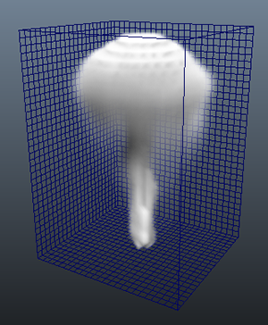
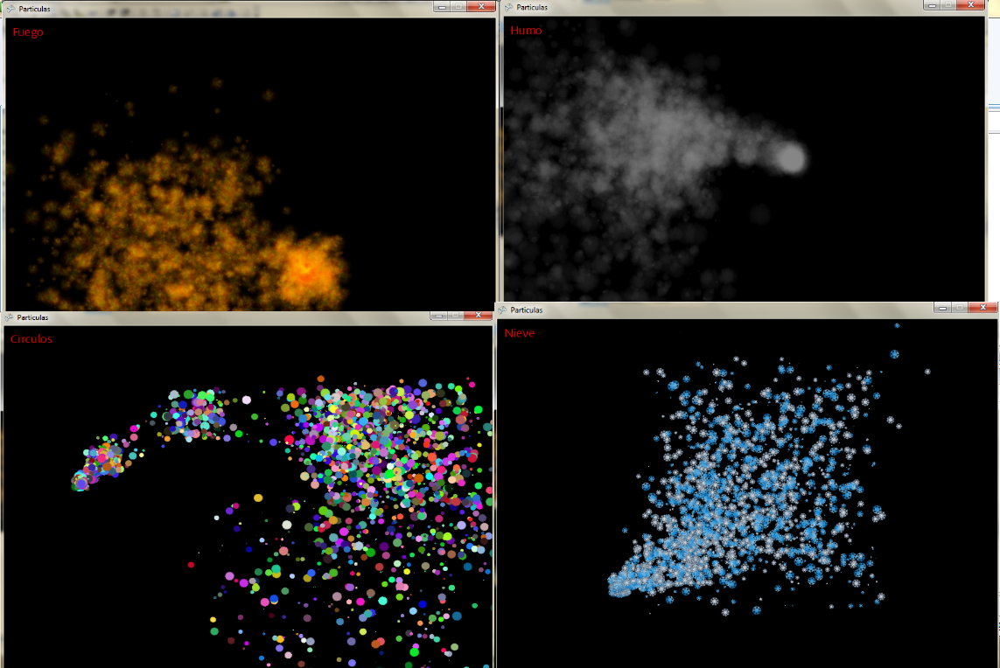
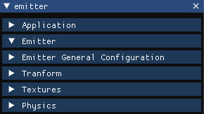
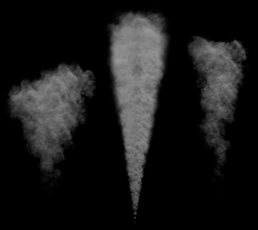

# TFG_NIAGARA

### Descripcion:

Los sistemas de partículas son un elemento muy importante de los videojuegos que aportan realismo e inmersión al jugador, estas, combinadas con efectos de postproducción, aportan detalles y completan la escena visualmente para que no parezca que falta algo o que la escena está vacía , no solo son importantes a nivel visual, también hay mecánicas que pueden basarse en este tipo de simulaciones.

El problema que presentan este tipo de simulaciones es que si se pretende conseguir resultados muy realistas, estas requieren de un gran cálculo de físicas y de renderizado que afectan al rendimiento general del juego, por lo tanto, es importante encontrar un sistema que consiga un punto medio que combine un buen resultado que sea creíble para el jugador, con una buena optimización que no afecte drásticamente al rendimiento del juego.
   
Para desarrollar este sistema se van a crear dos sistemas de partículas diferentes, una que simula de manera físicamente realista una simulación de humo con un renderizado de densidad realista, usando técnicas de Ray Tracing y de guardado en caché de la simulación para mayor optimización.

Por otra parte, el otro sistema estará más enfocado a la optimización, pensado para que afecte lo menos posible al rendimiento, pero también pensado para conseguir resultados que sean completamente creíbles para el jugador, este último sistema estará pensado para ser usado como los sistemas de partículas de Unity o Unreal, que dan más flexibilidad para crear todo tipo de sistemas.

El objetivo será comparar rendimientos y resultados de ambos sistemas para determinar cuál es más óptimo para ser usado en un contexto de real time y cuál es más apropiado para ser usado en un contexto donde los tiempos de cálculos no son tan relevantes como puede ser la industria cinematográfica.

### Uso:

Al ejecutar el programa aparecerá una ventana que le pedirá al usuario elegir entre los dos sistemas de partículas desarrollados, una vez seleccionado el sistema deseado, aparecerán las opciones del respectivo sistema

## Sistema de partículas simple (1):

Este sistema de partículas está más enfocado a poder utilizarse como los sistemas de partículas de Unity, que pueden usarse para poder realizar todo tipo de efectos, en este caso nos interesa incluir una gran cantidad de opciones para que el usuario pueda personalizarlo y conseguir el efecto que desea.

### Controles:

WASD: Para moverte por la escena.
Clic derecho: para girar la cámara 

### Opciones:

Como ya se ha comentado anteriormente, este sistema está enfocado a conseguir una gran variedad de resultados, por lo tanto, dispone de un amplio menú de opciones.

* Application:
Muestra información del rendimiento de la aplicación.

* Emitter General Configuration:
Muestra información y opciones generales del emisor.

* Transform:
Muestra información y opciones en relación al transform de las partículas.

* Textures:
Muestra información y opciones con relación a las texturas de las partículas opciones de animaciones, etc.

* physics:
Muestra información y opciones en relación a las físicas y colisiones de las partículas.

### Posibles resultados:

En el siguiente ejemplo se muestra un resultado simulando humo.

